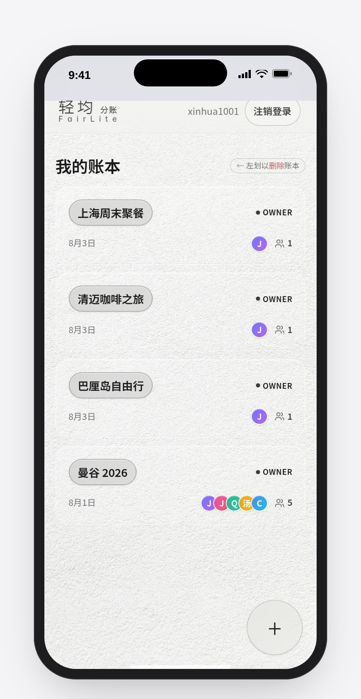
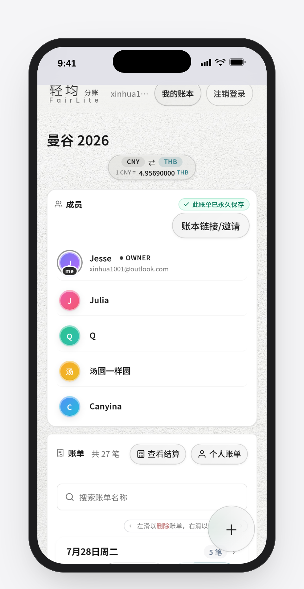
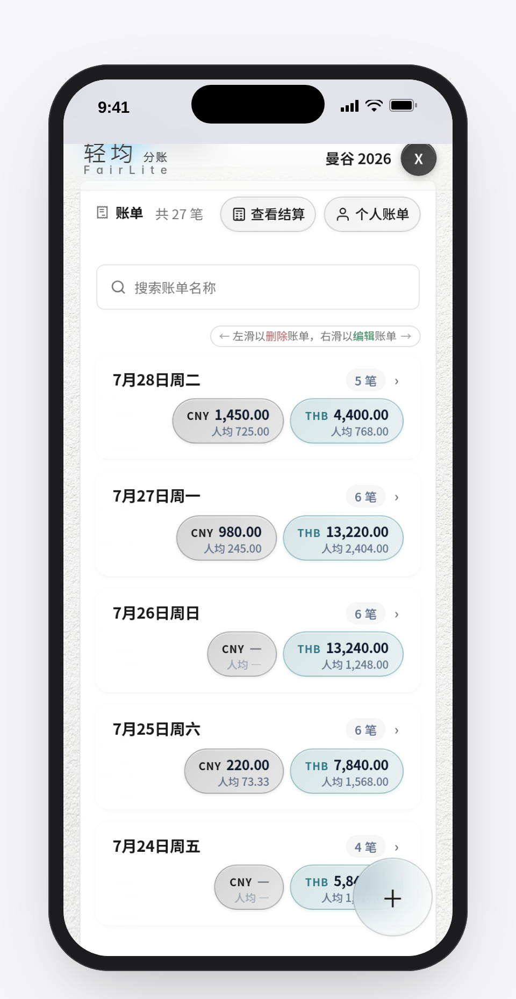
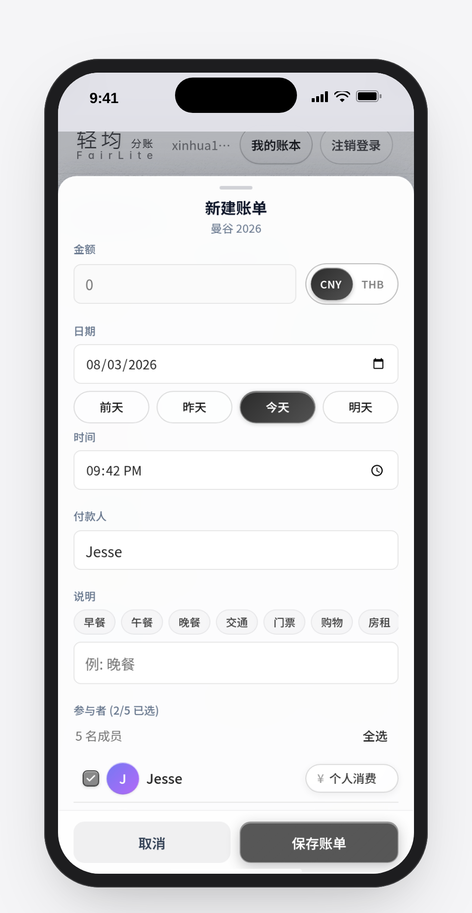
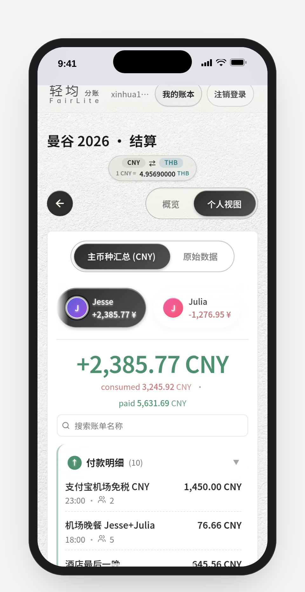

# 轻均分账 FairLite

极简分账，一链即平。

Mobile-first shared expense (AA) web app. Create a ledger, invite friends (including anonymous join), record multi-currency bills, and settle who owes whom.

**Language:** the UI is currently Chinese-only. English i18n is not included yet.


## Screenshots

**Walk-through:**
- **账本列表** — 一屏管多个账本, 玻璃质感卡片 + 人 icon 头像栈 + 角色标识 (OWNER / MEMBER).
  
- **账本详情** — 成员管理 + 多币种汇率 (CNY ⇄ THB) + 账本链接邀请 + 账单列表.
  
- **账单列表** — 按天分组的账单 + 每行含金额/币种/付款人/共享或独占标记 + 左滑删除/右滑编辑.
  
- **新建账单** — 算式输入 (`350/5` 自动计算) + 币种选择 + 日期 picker (iOS Safari 适配) + 付款人 + 分类 chip + 共享/独占切换.
  
- **结算概览** — 推荐转账 + 每人净收/净付 (绿/红) + 已结算记录 + 玻璃化 pill.
  
- **结算 - 个人视图** — 切换 tab 后展示单人付款明细 + 消费明细 + 主币种汇总.
  

*Source HTML mockup template is the iPhone 13 frame wrapper used to composite the raw page captures. Regenerate by capturing the 6 pages at 390×844 @2x and wrapping with the template (`width:362px height:816px`, `border-radius:42px`, status bar + Dynamic Island overlays).*

## Features

- Multi-person ledgers with invite links and anonymous nickname slots
- Bill CRUD with shared / exclusive (personal) consumption
- Multi-currency amounts with owner-managed exchange rates
- Settlement balances and recorded repayments
- Amount fields accept safe arithmetic expressions (e.g. `350/5`)
- Optional SMTP email verification (dev bypass via env, off by default)

## Stack

| Layer | Tech |
|-------|------|
| Frontend | SvelteKit 2 + Svelte 5 + TypeScript + Vite |
| Backend | FastAPI + SQLAlchemy 2 + Pydantic v2 + SQLite |
| Migrations | Alembic |
| Tests | pytest, Vitest, Playwright |

## Quick start

```bash
git clone <your-fork-or-clone-url>
cd split-bill-calculator

# Backend
cd backend
python -m venv .venv && source .venv/bin/activate
pip install -e ".[dev]"
cp .env.example .env   # edit SECRET_KEY and SMTP if needed
mkdir -p data
uvicorn app.main:app --reload --host 0.0.0.0 --port 8449

# Frontend (another terminal)
cd frontend
npm install
npm run dev -- --host 0.0.0.0 --port 8448
```

Open `http://localhost:8448`. Vite proxies `/api` to the backend on port `8449`.

### Optional demo seed

By default startup does **not** inject demo data when `SBC_SKIP_SEED=true` (recommended). To seed local fixtures:

```bash
cd backend
SBC_SKIP_SEED=false .venv/bin/python -m scripts.seed_dev_data
```

Demo login (only when listed in `DEV_BYPASS_EMAILS`): `demo@example.com` + any 6-digit code. Never enable bypass emails in production.

See `docs/TEST_DATA_MATRIX.md` for the seeded ledger matrix.

## Self-host with Docker

A pre-built image is published to Docker Hub:

**[`jessejiaclick1001/split-bill-calculator`](https://hub.docker.com/r/jessejiaclick1001/split-bill-calculator)**

Current tags:

| Tag | Notes |
|-----|-------|
| `cursor-arm64-v12` | Multi-stage image: FE build → Python 3.12 BE + Node 22 FE runtime; one image runs both backend (`:8449` internal) and frontend (`:8448` exposed). |

> ⚠️ The image is built for `linux/arm64` (Oracle ARM / Apple Silicon / AWS Graviton). For `linux/amd64` hosts, build locally — see below.

### Pull and run

```bash
docker pull jessejiaclick1001/split-bill-calculator:cursor-arm64-v12

# Backend listens on 8449 (internal), frontend on 8448 (exposed).
# Frontend proxies /api/* to backend over the sbc-net network.
docker network create sbc-net

docker run -d --name sbc-backend --network sbc-net \
  -v "$(pwd)/data:/app/backend/data" \
  -v "$(pwd)/backend/.env:/app/backend/.env:ro" \
  jessejiaclick1001/split-bill-calculator:cursor-arm64-v12

docker run -d --name sbc-frontend --network sbc-net \
  -p 8448:8448 \
  jessejiaclick1001/split-bill-calculator:cursor-arm64-v12
```

Open `http://localhost:8448`. Health check: `http://localhost:8449/version` (from the backend container).

### Compose with pre-built image

```yaml
# docker-compose.prod.yml — pull from Docker Hub (no local build)
services:
  backend:
    image: jessejiaclick1001/split-bill-calculator:cursor-arm64-v12
    container_name: sbc-backend
    command: ["/app/entrypoint.sh"]
    expose: ["8449"]
    volumes:
      - ./data:/app/backend/data
      - ./backend.env:/app/backend/.env:ro
    environment:
      - SBC_ENV=production
      - SBC_SKIP_SEED=true
      - SBC_SKIP_TEST_TRUNCATE=1
    restart: unless-stopped
    healthcheck:
      test: ["CMD", "curl", "-fsS", "http://localhost:8449/version"]
      interval: 30s
      timeout: 5s
      retries: 3
      start_period: 15s
    networks: [sbc-net]

  frontend:
    image: jessejiaclick1001/split-bill-calculator:cursor-arm64-v12
    container_name: sbc-frontend
    command: ["/app/entrypoint.sh"]
    ports: ["8448:8448"]
    expose: ["8449"]
    depends_on:
      backend: { condition: service_healthy }
    networks: [sbc-net]

networks:
  sbc-net: { driver: bridge }
```

`backend.env` should be a copy of `backend/.env.example` with `SECRET_KEY` filled in.

### Build locally (alternative)

The bundled `docker-compose.yml` uses `build:` for local dev — clone the repo and:

```bash
docker compose up backend frontend
```

Add the `cloudflared` service (`profiles: [tunnel]`) to expose via Cloudflare Tunnel once `CLOUDFLARE_TUNNEL_TOKEN` is set.

`docker-compose.deploy.yml` is an internal sandbox / cursor variant (different ports and bind-mounted data paths) — not intended for public self-host.

## Common commands

```bash
# Backend
cd backend && ruff check app/
cd backend && python -m pytest tests/ -q

# Frontend
cd frontend && npm run check
cd frontend && npm run test:unit
cd frontend && npm run build
```

## Project layout

```
backend/                  FastAPI app, models, Alembic, seeds, tests
frontend/                 SvelteKit app, unit + e2e tests
docs/                     Architecture and contributor notes
Dockerfile                Local-build Dockerfile (build context = repo root)
Dockerfile.deploy         Multi-stage Dockerfile that powers the Docker Hub image
docker-compose.yml        Local-build self-host (build: from Dockerfile)
docker-compose.deploy.yml Internal sandbox variant — not for public self-host
docker-compose.prod.yml   Compose that pulls from Docker Hub (see Self-host section)
```

More detail: [`docs/ARCHITECTURE.md`](docs/ARCHITECTURE.md).

## Configuration

Copy `backend/.env.example` → `backend/.env`. Important variables:

| Variable | Purpose |
|----------|---------|
| `SECRET_KEY` | App secret — generate a long random value for any shared deploy |
| `CORS_ALLOW_ORIGINS` | JSON array of allowed origins |
| `SMTP_*` | Email verification (optional in local/dev) |
| `DEV_BYPASS_EMAILS` | CSV of emails that skip SMTP (dev/test only) |
| `SBC_SKIP_SEED` | `true` skips startup demo seed (recommended default) |
| `COOKIE_SECURE` | Set `true` behind HTTPS |

Root `.env.example` is only for optional Docker / tunnel tokens.

## License

MIT — see [`LICENSE`](LICENSE).

## Security

Please report vulnerabilities privately — see [`SECURITY.md`](SECURITY.md).